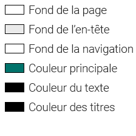

# NomDuSite

<!--TODO: Nom du site-->

> La musique est de plus en plus présente dans notre vie au quotidien. Quel impact a t-elle vraiment au quotidien et sous quelles formes ? C'est pour répondre a ceci que nous avons conçu ce site car nous sommes passionés de musique.

- [NomDuSite](#nomdusite)
  - [I. L'idée du site](#i-lid%c3%a9e-du-site)
    - [a. Le contenu](#a-le-contenu)
    - [b. Le public](#b-le-public)
  - [II. Charte Graphique](#ii-charte-graphique)
    - [a. Choix des couleurs](#a-choix-des-couleurs)
    - [b. Choix des polices d'écritures](#b-choix-des-polices-d%c3%a9critures)
    - [c. Structure des pages](#c-structure-des-pages)
  - [III. Equipe](#iii-equipe)
    - [a. Répartition des tâches](#a-r%c3%a9partition-des-t%c3%a2ches)
    - [b. Organisation](#b-organisation)
  - [IV. Annexes](#iv-annexes)
    - [a. Structure](#a-structure)
    - [b. Sources](#b-sources)

<div style="page-break-after: always;"></div>

## I. L'idée du site

### a. Le contenu

Nous n'allons pas présenter d'époques ni de périodes particulières mais plus faire une histoire générale de la musique, montrer comment la musique influence nos vies au quotidien et faire la présentation de différents style : Rock, metal, électro, alternative, pop et rap.

Pour ce faire, nous imaginons un site avec un style moderne, avec des vidéos, des liens vers sites d'actualité musicales et des liens vers des applis musique.

Ce site n'est pas une plateforme de référencement, plus d'une plateforme pour découvrir certains styles et des artistes de la musique.

### b. Le public

Le public visé par notre site sont les adolescents, les adultes et les seniors.

## II. Charte Graphique

  !!!info
    Polices d'écritures provenant de [Google Fonts](https://fonts.google.com/).

### a. Choix des couleurs

Principales couleurs de la page :



Nous avons choisi de faire un thème lumineux pour une meilleure intégration du contenu. Le fond sera donc d'une couleur claire (blanche) avec un motif discret pour éviter un fond ennuyant.

<div style="page-break-after: always;"></div>

Le fond de la navigation sera distingué du reste de la page grâce à une image floutée, en fonction du style de musique.

Les couleurs choisies sont en accord avec le fond, le texte est avec un contraste suffisamment élevé pour rester lisible.

### b. Choix des polices d'écritures

Nous avons choisit une police d'écriture légère et fine (Roboto avec un poids de 100) pour le titre afin de rester dans un thème léger. Le reste du texte est avec la même police d'écriture mais avec un poids plus grand (400).

### c. Structure des pages


<!--TODO: Structure page-->

Le contenu est centré sur la page est occupe 90% de la largeur disponible, la barre de navigation est sur le coté est apparait au survol de la zone.

Pour la version mobile, la barre de navigation est en dessous du titre, avec un élément par ligne. Le contenu occupe la totalité de l'écran est utilisé.

## III. Equipe

### a. Répartition des tâches

Chacun a fait sa partie à partir d'une base créée de façon commune.

Chacun développe son style pour sa page après avoir défini des règles communes.

La page d'accueil à été créée de façon commune, les points délicats on étés abordés par les membres les plus expérimentés, les points plus "simples" on été fait par les membres un peu moins expérimentés.


<!--TODO: Organigramme-->

### b. Organisation

Nous utilisons GitHub pour le partage du code source, des images et des ressources (fichiers utilisés pour la création d'images).

Nous avons aussi tout de suite défini quels styles de musique chacun allait aborder pour faire nos recherches de notre coté.

<div style="page-break-after: always;"></div>

## IV. Annexes

### a. Structure

```bash
|   footer.html
|   index.html
|   nav.html
|
|--css
|     mobile.css
|     style.css
|--music
|     electro.html
|     metal.html
|     pop.html
|     rock.html
|     rap.html
|    alternative.html
\--res
        head_back.mp4
        autres images
```

<!--TODO: MAJ Structure-->

### b. Sources

DES SOURCES !
